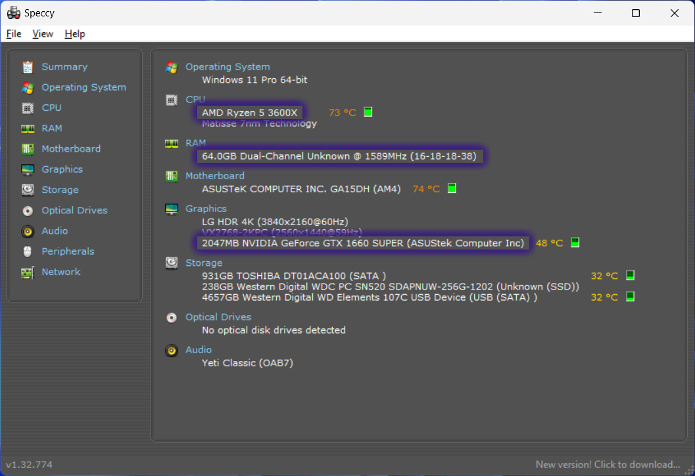

# Understanding Your Hardware Limitations
{: .no_toc }

## Table of Contents
{: .no_toc .text-delta }

1. TOC
{:toc}

-----

I think before we get started on anything, we need to address the elephant in the room. Your computer specs will determine your ability to VTube and stream in general. It's important to note that just because you can play a game without issues normally, your computer may not be able to handle running the same game, having VTubing software running, and streaming at the same time.

While this section can be a bit technical, I will try my best to explain things as easily as possible so that people who aren't familiar with computers can understand.

## What is the Minimum Computer Specs for VTubing/Streaming?
The long answer is it depends based on what type of VTuber model you plan on using and what games you intend on streaming. Multiple factors (namely your CPU, RAM, and GPU) will determine whether or not certain games will run smoothly on your computer. One thing to keep in mind is that your computer will need to **exceed** the minimum requirements of the games you intend on playing in order to account for VTubing and streaming software running as well.

The short answer is that I would recommend **at least**:

| Component | Recommendation
| --------- | -------------- |
| CPU | A modernish-gen (10th gen or above) i5 or equivalent
| RAM | At least 16 GB of RAM
| GPU | A GTX 1060-equivalent

### Hololive Comparison
Here is how the minimum requirements compare to some of the computers used by the talents in Hololive (data from [2021]((https://www.reddit.com/r/Hololive/comments/ko50fu/hololive_member_pc_specs_cpu_and_gpu/)) and [2023](https://www.reddit.com/r/Hololive/comments/113mf3n/nene_casual_pc_specs_flex/), RAM is speculative):

| Component | Minimum | Median | Maximum |
| --------- | ------- | ------ | ------- |
| CPU | [Intel Core i5-10400](https://www.cpubenchmark.net/cpu.php?cpu=Intel+Core+i5-10400+%40+2.90GHz&id=3737)   Avg. CPU Mark: 12130   Price: $75-150 | [Intel Core i9-9900K](https://www.cpubenchmark.net/cpu.php?cpu=Intel+Core+i9-9900K+%40+3.60GHz&id=3334)   Avg. CPU Mark: 18311   Price: $250-400 | [Intel Core i9-13900KF](https://www.cpubenchmark.net/cpu.php?cpu=Intel+Core+i9-13900KF)   Avg. CPU Mark: 58656   Price: $400-600
| RAM | 16 GB   Price: $50-100 | 64 GB   Price: $150-250 | 128 GB   Price: $300-500
| GPU | [GTX 1060](https://www.videocardbenchmark.net/gpu.php?gpu=GeForce+GTX+1060&id=3548)   Avg. G3D Mark: 10073   Price: $50-150 | [GTX 2080 Ti](https://www.videocardbenchmark.net/gpu.php?gpu=GeForce+RTX+2080+Ti&id=3991)   Avg. G3D Mark: 21785   Price: $200-400 | [GTX 4080](https://www.videocardbenchmark.net/gpu.php?gpu=GeForce+RTX+4080&id=4622)   Avg. G3D Mark: 34610   Price: $800-1200

-----

## How Do I Know if I Meet These Requirements?
**For RAM and CPU (if you have an Intel Core processor)**, you can check if your meet these minimum requirements by using something like [Speccy](https://www.ccleaner.com/speccy). For the CPU, a 10th gen i5 will show as `i5-10XXX`, an 11th gen as `i5-11XXX`, etc.

If you don't feel comfortable downloading something, you can always Google how to do it for your operating system.

**For GPU and CPU (if you don't have an Intel Core processor)**, it will be a bit harder to compare. You can compare benchmark scores by [searching for your GPU](https://www.videocardbenchmark.net/gpu_list.php) or [searching for your CPU](https://www.cpubenchmark.net/cpu_list.php) and seeing if their benchmark scores meet or exceed those of the recommended GPU ([GTX 1060](https://www.videocardbenchmark.net/gpu.php?gpu=GeForce+GTX+1060&id=3548)) or CPU ([Intel Core i5-10400](https://www.cpubenchmark.net/cpu.php?cpu=Intel+Core+i5-10400+%40+2.90GHz&id=3737)).

### Example Comparison

{: .note }
It's important to take everything with a grain of salt. You won't really know if you can run something until you try it out yourself but you can at least rule something in or out if your benchmarking scores are vastly inferior or superior to the minimum requirements of a game.

Let's use my current computer's specs and compare them to the [minimum requirements to run Dragon's Dogma 2](https://store.steampowered.com/app/2054970/Dragons_Dogma_2/), a very resource-intensive game that came out recently. Since both Intel and AMD CPUs are listed, as well as NVIDIA and AMD GPUs, we will compare our components with the respective brand listed (bolded).

| Components  | My Computer Specs | Dragon Dogma 2's Minimum Requirements | Status |
| ----------- | ----------------- | ------------------------------------- | ------ |
| CPU         | [AMD Ryzen 5 3600X](https://www.cpubenchmark.net/cpu.php?cpu=AMD+Ryzen+5+3600X&id=3494)   Avg. CPU Mark: 18216| [Intel Core i5 10600](https://www.cpubenchmark.net/cpu.php?cpu=Intel+Core+i5-10600+%40+3.30GHz&id=3750) / [AMD Ryzen 5 3600](https://www.cpubenchmark.net/cpu.php?cpu=AMD+Ryzen+5+3600&id=3481)   Avg. CPU Mark: 13675 / **17767** | **PASS** |
| RAM         | 64 GB | 16 GB | **PASS** |
| GPU         | [NVIDIA GeForce GTX 1660 SUPER](https://www.videocardbenchmark.net/gpu.php?gpu=GeForce+GTX+1660+SUPER&id=4159)   Avg. G3D Mark: 12776 | [NVIDIA GeForce GTX 1070](https://www.videocardbenchmark.net/gpu.php?gpu=GeForce+GTX+1070&id=3521) / [AMD Radeon RX 5500 XT with 8GB VRAM](https://www.videocardbenchmark.net/gpu.php?gpu=Radeon+RX+5500+XT&id=4174)   Avg. G3D Mark: **13510** / 9164 | **FAIL** | 

According to Dragon Dogma 2's Steam page, the minimum requirements are for "1080p/30fps". Keeping the above advice in mind, this means that in theory, I should expect frame drops or stuttering gameplay when running the game alone **before** accounting for VTubing and streaming software. I **might** be able to get it to run more smoothly and stream it if I reduced the resolution to 720p and turned down additional graphics settings like texture quality, shadow quality, and anti-aliasing.

### Additional Resources

If you can't make heads or tails out of any of this, there are also communities that may be able to help you decipher whether or not you can run a game:

* [r/CanIRunIt](https://www.reddit.com/r/CanIRunIt/) - "A community with the goal to help computer enthusiasts figure out if they can run certain video games or applications."
* [r/LowEndGaming](https://www.reddit.com/r/lowendgaming/) - "A community for anyone struggling to find something to play for that older system, or sharing or seeking tips for how to run that shiny new game on yesterday's hardware."

-----

## What Do I Do if I Don't Meet The Minimum Requirements?

{: .warning }
I would not recommend upgrading or building a computer if you do not know what you are doing. Building a computer can be cheaper than buying a pre-built one but if you are not handling or installing components correctly, you could easily cause irreparable damage to them.

If you don't meet the minimum requirements, you have 3 options:

1. Upgrade parts
2. Build or buy a new computer
3. PNGTUber + streaming older games

### Upgrade Parts

If, like the example above, your computer meets most of the minimum requirements but needs an upgrade in only a few departments, you may be able to upgrade it. However, keep in mind that this might be difficult if you have a laptop or an older desktop.

Laptops are nearly impossible to upgrade and the only components that are easily upgradable are often the hard drive and the RAM and old desktops are held back by their motherboard, which limits what other components are compatible with it. While you can upgrade a desktop's motherboard, you would basically be building a computer pretty much from scratch at that point.

-----

### Build or Buy a Computer

#### Building a Computer

If you are experienced and looking to build a PC, but need suggestions on hardware that fit your budget, you can check out these Reddit communities:
* [r/BuildAPC](https://www.reddit.com/r/buildapc/) - "A community-driven subreddit dedicated to custom PC assembly. Anyone is welcome to seek the input of our helpful community as they piece together their desktop."
* [r/BuildMeAPC](https://www.reddit.com/r/buildmeapc/) - "If you are new to computer building, and need someone to help you put parts together for your build or even an experienced builder looking to talk tech you are in the right place!"

#### Buying a Computer

If you are looking to buy a pre-built computer, a computer that I’ve seen recommended at a price point that checks all these boxes is the [NZXT “Player: One” at $799 (before taxes)](https://nzxt.com/product/player-one). While this isn’t an endoresement for this product or company, you can use this as a benchmark in computer specs and price when shopping for other pre-built computers.

However, before pulling the trigger, there are some things to take into account:

##### Desktop

| Pros  | Cons |
| ----- | ---- |
| Usually cheaper than a comparable laptop | Hidden cost of monitor, keyboard, mouse, webcam, and microphone. |
| Upgradable but only a pro if you intend on doing so. | |

##### Laptop

| Pros  | Cons |
| ----- | ---- |
| Have a monitor, keyboard, and touchpad built-in. Often times have webcam and microphone built-in, although you may want to still upgrade these. | Usually cost more than a comparable desktop |
| | Less upgradable (often only RAM and hard drive) |
| | A desktop CPU and GPU and not the same as a laptop CPU and GPU. Laptop hardware is often less beefy than their desktop counterparts, despite having the same or similar names.

-----

### PNGTuber + Streaming Older Games

If you are running on older hardware or a laptop with an integrated graphics chip and don't have the resources for an upgrade, it may be best to start as a PNGTuber playing retro or indie games that require less resources.

